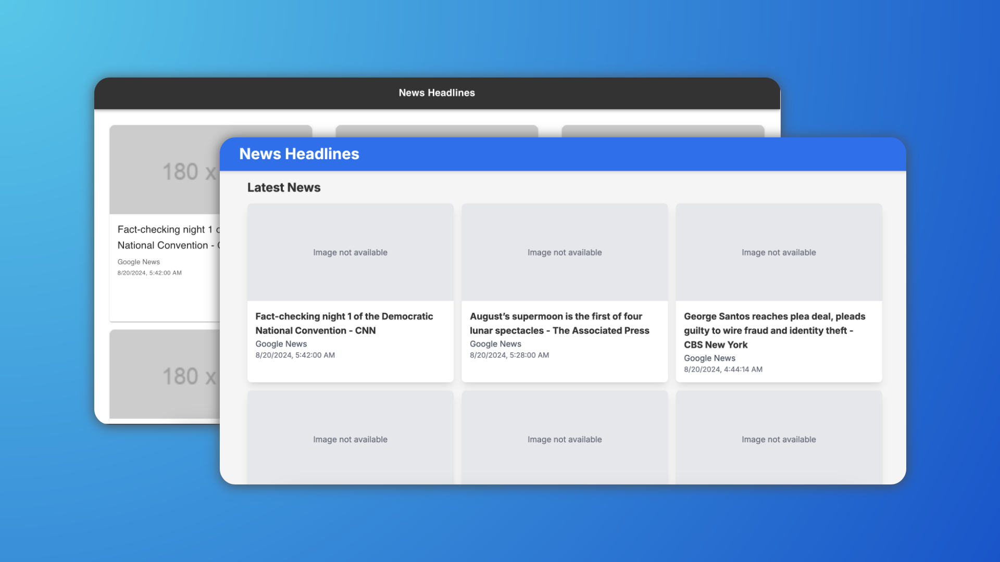

# News Headlines App



This is a React and Next.js web application that displays the latest news headlines from the NewsAPI. The app features a modern design with dark mode enabled by default.

## Features

- Displays a list of news headlines from the NewsAPI.
- Each news item includes:
  - Title
  - Source
  - Author
  - Date
  - Description
  - Thumbnail image
- Clicking on a headline navigates to a detailed view of the article.
- Dark mode is enabled by default for a better user experience.

## Technologies Used

- **React**: A JavaScript library for building user interfaces.
- **Next.js**: A React framework that enables server-side rendering and static site generation.
- **Tailwind CSS**: A utility-first CSS framework for styling the application.
- **NewsAPI**: An API to fetch the latest news headlines.

## Branches

This repository contains two separate branches for different implementations of the application:

1. **feature/react-news-app**:

   - This branch contains the implementation using React with React Router for navigation.
   - The application is structured with components such as `Header`, `NewsList`, `NewsCard`, and `ArticleDetail`.

2. **nextjs-implementation**:
   - This branch contains the implementation using Next.js.
   - It utilizes Next.js routing and server-side rendering features for better performance and SEO.

## Getting Started

To get a local copy of the project up and running, follow these steps:

### Prerequisites

- Node.js (version 14 or higher)
- npm (Node package manager)

### Installation

1. Clone the repository:

   ```bash
   git clone https://github.com/0x5un5h1n3/news-headlines-webapp.git
   cd news-headlines-app
   ```

2. Install the dependencies:

   ```bash
   npm install
   ```

3. Create a `.env` file in the root directory and add your NewsAPI key:

   ```plaintext
   REACT_APP_NEWS_API_KEY=your_api_key_here
   NEXT_PUBLIC_NEWS_API_KEY=your_api_key_here
   ```

4. Run the application:

   ```bash
   npm run dev
   ```

5. Open your browser and navigate to `http://localhost:3000`.

## Usage

- Browse the latest news headlines.
- Click on any headline to view the full article.
- The application is designed to be responsive and mobile-friendly.

## Contributing

Contributions are welcome! If you have suggestions for improvements or features, feel free to create an issue or submit a pull request.

## License

This project is licensed under the MIT License - see the [LICENSE](LICENSE) file for details.

## Acknowledgements

- [NewsAPI](https://newsapi.org) for providing the news data.
- [React](https://reactjs.org) and [Next.js](https://nextjs.org) for building the application.
- [Tailwind CSS](https://tailwindcss.com) for styling the components.
